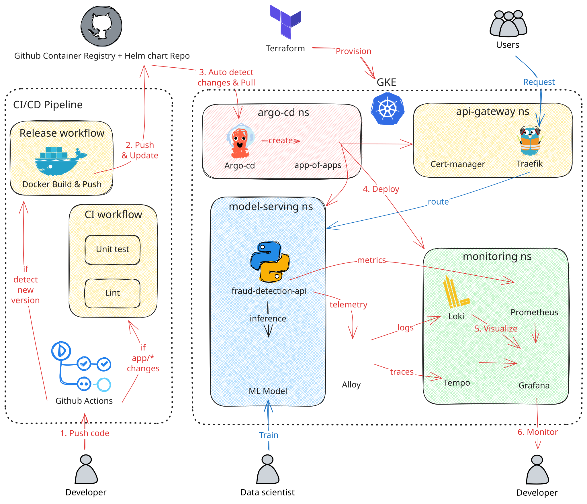

# Payment Gateway and Real-Time Fraud Detection

This project is evolving from a terminal-oriented fraud prediction API into an ecommerce payment gateway with fraud decisioning. The planned gateway owns hosted checkout, payment execution and risk decisions; the marketplace keeps ownership of customers, sellers, orders and inventory. Initial processing uses synthetic payment-method tokens and a processor simulator.

The current repository contains a Go HTTP edge backed by a Python gRPC fraud service, a bundled model, behavior tests, container/CI configuration, Talos GitOps manifests and application telemetry. Gateway services, ecommerce feature pipelines and the coursework extensions are planned. Source/configuration presence does not establish a live deployment or completed coursework.

## Repository structure

```text
.
├── .github/workflows/      # Independent check jobs, image build workflow, wiki publication
├── CONTRIBUTING.md         # Environment, local checks, code generation, CI and images
├── contracts/              # Versioned protobuf service contracts
├── docs/
│   ├── architecture/      # Gateway overview, payment and data/ML flows, conventions, roadmap
│   ├── deployment/        # GitOps, runtime configuration, observability and screenshots
│   ├── verification/      # Evidence, model provenance and superseded gates
│   └── research/          # Background, experiments and images
├── infra/
│   ├── argocd/            # Application catalog and dev/prod roots
│   ├── charts/            # Fraud-service Helm chart
│   └── docker/            # Service Dockerfiles and reusable Go template
├── openspec/              # Capability specifications and change plans
├── src/edge/              # Public HTTP edge and generated gRPC client
├── src/fraud-service/     # gRPC fraud service, bundled model, tests and generated bindings
├── devenv.nix             # Local development environment
├── devenv.yaml            # Devenv inputs
└── devenv.lock            # Locked environment dependencies
```

## Documentation

Browse the [project wiki](https://github.com/phuchoang2603/realtime-credit-card-fraud-detection/wiki) for architecture, the implementation roadmap, deployment and verification evidence; see [CONTRIBUTING](CONTRIBUTING.md) to work in the repository. Delivery is tracked on the [project board](https://github.com/users/phuchoang2603/projects/3).

## Historical demo and diagram

The demo and diagram describe earlier fraud-service work; they do not demonstrate the planned gateway or current operational status.

[](https://youtu.be/SOBmdxpqs5E)


