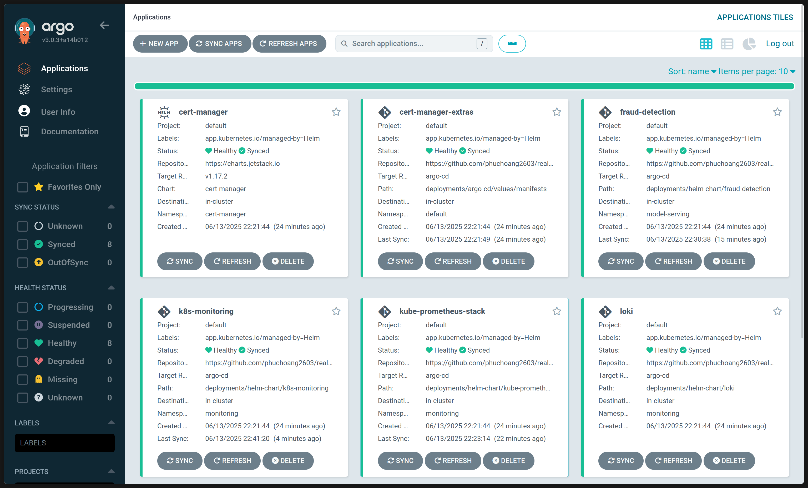
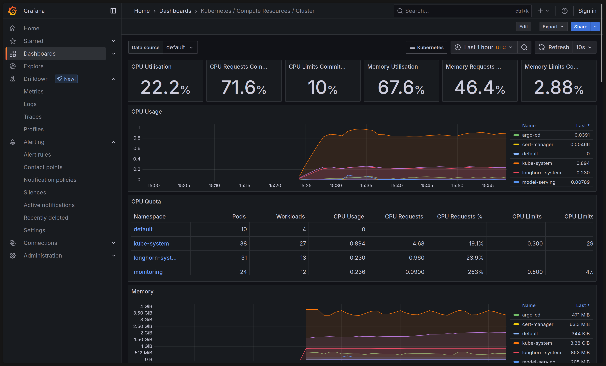
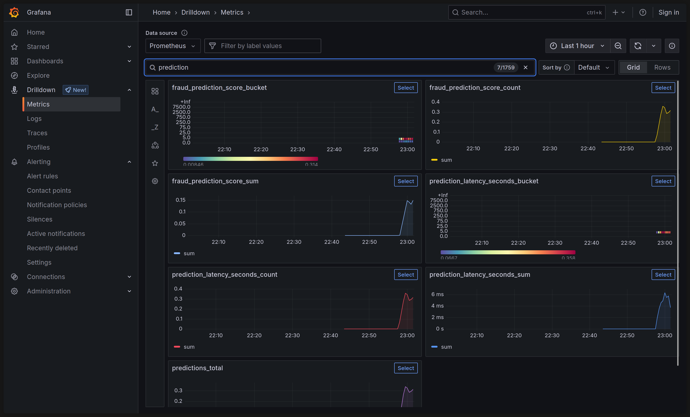
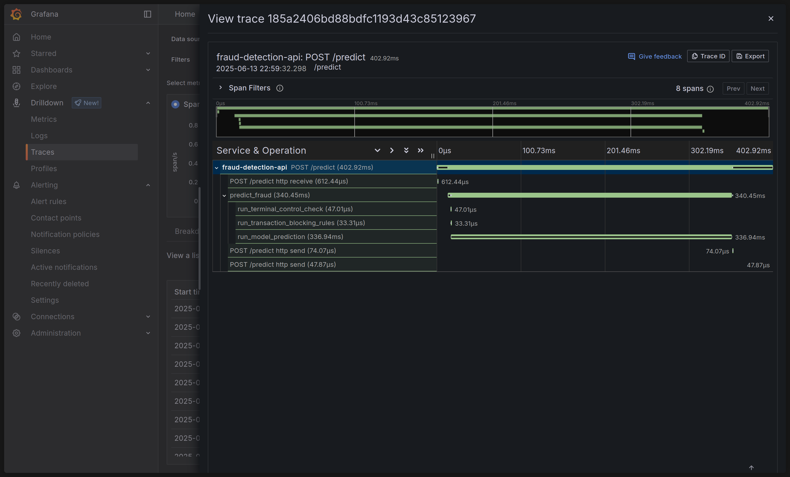

# Unified GitOps Deployment

This repository contains the infrastructure and application manifests for deploying a real-time credit card fraud detection system. The entire stack is managed declaratively using a GitOps workflow.

This guide outlines the technology stack and provides a complete, end-to-end guide for:

1. Provisioning the GKE cluster infrastructure with **Terraform**.
2. Bootstrapping all applications with a unified **Argo CD "App of Apps" Helm chart**.

## 🚀 Deployment Instructions

### Prerequisites

Before you begin, ensure you have the following tools installed and configured:

- **`gcloud`**: Authenticated to your GCP account.
- **`terraform`** (v1.5.0+)
- **`kubectl`**
- **`helm`**
- **`gke-gcloud-auth-plugin`**: Required for `kubectl` to authenticate with GKE

### Phase 1: Provision the GKE Cluster with Terraform

This phase uses Terraform to create the foundational Kubernetes cluster on GCP.

1. **Navigate to the Terraform directory:**

   ```bash
   cd terraform  # Assuming your .tf files are in a 'terraform' directory
   ```

2. **Create your configuration file.** Create a file named `terraform.tfvars` and add your GCP project ID.

   ```hcl
   # terraform.tfvars
   gcp_project_id = "your-gcp-project-id"
   ```

3. **Initialize Terraform.** This downloads the necessary providers.

   ```bash
   terraform init
   ```

4. **Apply the configuration.** This will create the GKE cluster and deploy Argo CD onto it. This process can take 10-15 minutes.

   ```bash
   terraform apply -auto-approve
   ```

5. **Connect `kubectl` to Your New Cluster.** After the `apply` command finishes, Terraform will display outputs. Copy the `gke_connect_command` and run it in your terminal.

   ```bash
   # Example output from Terraform:
   # gke_connect_command = "gcloud container clusters get-credentials my-gke-cluster --zone asia-southeast1-a --project your-gcp-project-id"

   # Run the command provided in your terminal output
   gcloud container clusters get-credentials ...
   ```

### Phase 2: Deploy Applications via App of Apps

Now that the cluster is running and Argo CD is installed, we will use a parent Helm chart to tell Argo CD what to deploy.

1. **Navigate to the App of Apps chart directory:**

   ```bash
   cd ../argo-apps # Navigate to your parent chart directory
   ```

2. **Configure Your Environment.** Edit the main `values.yaml` in this directory to set your cluster-wide variables (domain, IP, tokens). For advanced settings, you can edit the files in the `values/` sub-directory.
3. **Deploy the "App of Apps" Chart.** This single command bootstraps your entire platform by creating the Argo CD `Application` resources.

   ```bash
   helm install argo-apps . -n argo-cd
   ```

### Step 3: Verify in Argo CD

Open your Argo CD UI. You will see all the applications (`traefik`, `cert-manager`, `loki`, `grafana`, etc.) being created and moving towards a `Synced` and `Healthy` state. Due to dependencies (like CRDs), some apps may retry syncing, which is normal behavior.

Expected Results


Grafana Metrics Dashboard (Prometheus)



Grafana Logs View (Loki)


Grafana Traces View (Tempo)


## 💣 Uninstallation

To completely remove the entire platform, you must perform the steps in reverse.

1. **Uninstall the App of Apps Helm chart.** This deletes the Argo CD `Application` resources, which will cause Argo CD to prune all deployed applications.

   ```bash
   helm uninstall argo-apps -n argo-cd
   ```

2. **Destroy the Infrastructure with Terraform.**

   ```bash
   cd ../terraform # Navigate back to the terraform directory
   terraform destroy -auto-approve
   ```
