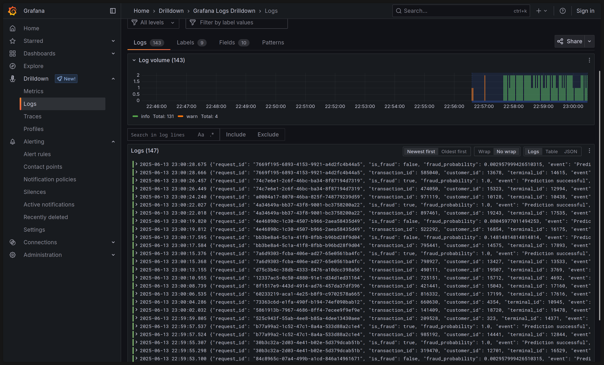

# GitOps Deployment

This repository contains the infrastructure and application manifests for deploying a real-time credit card fraud detection system. The entire stack is managed declaratively using a GitOps workflow powered by Helm and Argo CD.

This guide outlines the technology stack and provides step-by-step instructions for deploying the core infrastructure and monitoring services.

## Technology Stack

This project uses a modern, cloud-native stack for observability and deployment, managed by two primary "App of Apps" Helm charts.

- **`k8s-monitoring-helm`**: This is the all-in-one chart responsible for data collection.
  - **Grafana Alloy**: Deployed as the primary collector agent. It scrapes metrics, collects logs, and acts as a receiver for application traces (OTLP).
- **`kube-prometheus-stack`**: This chart provides the backend for metrics storage and visualization.
  - **Prometheus**: The time-series database where all metrics collected by Alloy are stored. It is configured to receive data via `remote_write`.
  - **Grafana**: The visualization platform for creating dashboards for all our telemetry data (metrics, logs, and traces).
- **Loki**: The backend system for storing and querying all application and cluster logs collected by Alloy.
- **Tempo**: The backend system for storing and querying distributed traces sent from the application via the Alloy OTLP receiver.
- **Traefik**: The Ingress Controller managing external access to services.
- **Cert-Manager**: Provides automatic TLS certificate provisioning from Let's Encrypt using Cloudflare for DNS validation.

## Deployment Instructions

These instructions will guide you through deploying the entire platform using the single, unified "App of Apps" Helm chart.
Prerequisites

- A running Kubernetes cluster (e.g., RKE2).
- kubectl command-line tool installed and configured.
- helm command-line tool installed.
- Argo CD installed and running in the argo-cd namespace in your cluster.

### Step 1: Configure Your Environment

All user-specific configurations for the entire platform are centralized in the main `values.yaml` & `values/ folder` of the argo-apps chart. Navigate to the chart directory values folder:

```bash
cd argo-apps/values/
```

### Step 2: Deploy the "App of Apps" Chart

Once your configuration is set, you can deploy the parent Helm chart. This single command bootstraps your entire platform.
From the argo-apps/ directory, run the following Helm command:

```bash
helm install argo-apps . -n argo-cd
```

### Step 3: Verify in Argo CD

Open your Argo CD UI. You will see all the applications (traefik, cert-manager, loki, grafana, etc.) being created and moving towards a Synced and Healthy state. Due to dependencies (like CRDs), some apps may retry syncing, which is normal behavior.

Expected Results


Once all applications are synced, you will have a fully functional ingress and observability stack.

Grafana Metrics Dashboard (Prometheus)


Grafana Logs View (Loki)


Grafana Traces View (Tempo)


## Uninstallation

To completely remove the entire platform, you only need to uninstall the parent Helm chart. This will delete the Argo CD Application resources, which will, in turn, cause Argo CD to prune and delete all the associated Kubernetes resources from your cluster.

```bash
helm uninstall argo-apps -n argo-cd
```
