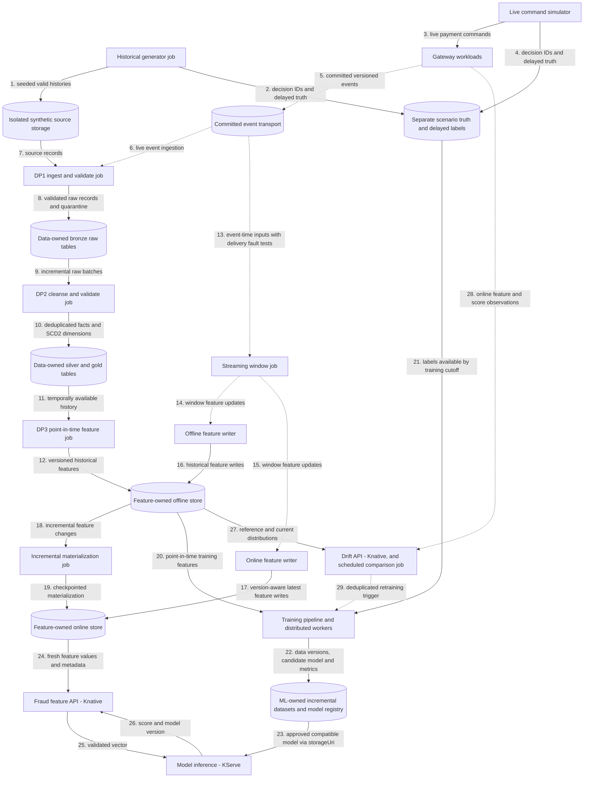

# Data and ML flows

Planned generators, DP1–DP3 pipelines, feature stores, training and drift monitoring. Deployable units and the deployment view are in the [architecture overview](payment-gateway.md); payment contracts are in [payment flows](payment-flows.md). Capability coverage and required proof are tracked in the [roadmap](roadmap.md).

## Flow

Solid arrows show batch/storage transfers and synchronous reads; dotted arrows show streaming events or asynchronous triggers. Storage nodes are labelled by role; feature-access libraries are embedded in jobs/APIs rather than depicted as deployable services.

## Generation

Historical generation persists valid lifecycle histories outside bronze and outside production payment event storage. Live simulation calls gateway commands so Payments creates authoritative events. Both modes share versioned scenarios for customer, seller, device and synthetic method profiles: ordinary purchases, stolen-card/new-device behavior, unusual geography, reshipping, card testing and retry attacks. Burst, lateness and duplicate delivery are transport conditions; they never fabricate duplicate authoritative transitions.

## Pipelines and schemas

DP1 ingests and validates raw records; DP2 cleanses and curates them; DP3 computes historical features. Each has observable ingest/validate stages, reusable centrally managed connections/configuration, quarantine or failed-validation evidence, and source/table/job lineage. Bronze uses `raw_`, silver `stg_`, and gold `dim_`, `fact_`, `obt_`, `feat_` conventions. SCD2 dimensions carry `valid_from_ts`, `valid_to_ts`, `is_current`; feature tables carry `event_timestamp` and `created`.

Streaming windows specify event time, watermarks, allowed lateness, deduplication and restart semantics. Offline and online writers are independently observable. Incremental materialization has checkpoints, retries and version-aware idempotency; older late writes cannot replace newer online state. Per-feature TTL, stale/missing defaults and feature-version compatibility protect serving.

## Training and drift

Training grain is one scored attempt/decision, not one payment event. Joins use scoped identity plus decision/attempt IDs; labels remain separate with `label_available_at`. Features use only information available at decision time, including ingestion/availability timestamps when events arrive late. Future outcomes, fraud truth and the decision itself must not leak into its features. Temporal evaluation splits, cold starts and late-label cases require explicit proof.

Training extends the accepted [mini baseline (#67)](https://github.com/phuchoang2603/realtime-credit-card-fraud-detection/issues/67): [notebook acceptance (#53)](https://github.com/phuchoang2603/realtime-credit-card-fraud-detection/issues/53) requires that baseline, although exploration can overlap. Distributed training, incremental dataset storage, model registration and approved-model rollout to KServe ([#70](https://github.com/phuchoang2603/realtime-credit-card-fraud-detection/issues/70)) add capabilities without replacing mini generators, pipelines, windows or evidence. Drift compares versioned distributions without assuming immediate labels; retraining is deduplicated and cooldown-controlled, and promotion remains separately gated. See the [handoff checklist](roadmap.md#mini-to-final-handoff).
