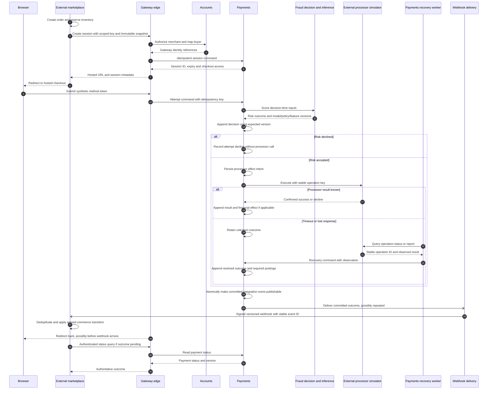

# Payment flows

Identity, checkout and payment-authority contracts for the planned gateway, with the checkout and recovery sequence. Deployable units and the deployment view are in the [architecture overview](payment-gateway.md); data and training flows are in [data and ML flows](data-ml-flows.md).

## Identity and checkout contract

One authenticated marketplace integration manages separate gateway merchant accounts for its sellers. Accounts maps `(integration_id, external_seller_id)` to `merchant_id` and `(integration_id, external_buyer_id)` to `customer_id`. Derive integration identity from credentials, not caller-selected tenant fields or email. Authorize seller provisioning explicitly and make it idempotent; buyer mapping may be lazy.

Buyer authentication remains at marketplace. Gateway checkout uses short-lived, scoped access without gateway buyer passwords or shared marketplace JWT secrets. Merchant records do not imply wallets, payouts or bank accounts. Credential rotation, revocation, disabled-account handling and tenant isolation belong to [PG-03 (#31)](https://github.com/phuchoang2603/realtime-credit-card-fraud-detection/issues/31) and [Accounts (#34)](https://github.com/phuchoang2603/realtime-credit-card-fraud-detection/issues/34).

Keep order, session, payment and attempt identifiers distinct. Scope external order references to the integration and merchant. Session creation is idempotent for the agreed order scope; a changed payload under an existing key is a conflict. Refreshing hosted checkout creates no new attempt. Amount/currency and commerce snapshots are immutable for that session; return URLs are validated. Signed webhook delivery and authenticated status queries determine commerce outcomes, never the buyer redirect alone.

The marketplace's [current webhook handler](https://github.com/phuchoang2603/refurbished-marketplace/blob/main/services/payment/internal/service/gateway_webhook.go) treats failed sessions as terminal and suppresses subsequent terminal outcomes. Target retries under the same order therefore require a contract change: [PG-04 (#32)](https://github.com/phuchoang2603/realtime-credit-card-fraud-detection/issues/32) must separate attempt decline from final payment failure, specify expiry/late-success handling, and coordinate inventory behavior with marketplace.

## Payment authority and recovery

Payments owns an ordered event stream per aggregate. Commands validate authoritative aggregate state and append with an expected version; stale status projections cannot authorize money movement. Durable idempotency stores the request identity, content binding and result so concurrent retries cannot create additional effects. Status views and snapshots are rebuildable; schema versions, correlation IDs and causation IDs preserve interpretation.

Persist an external-effect intent before calling the processor and reuse a stable operation key on retries. A timeout means **unknown**, not declined: query processor status or reconcile its reports before deciding whether another operation is safe. Record discovered results as new events. Reconciliation uses stable operation/transaction IDs rather than timestamp equality and separates timing differences from true discrepancies.

Record each risk outcome with model, policy and feature versions. Aggregate replay consumes the recorded outcome; it never reruns models, invokes processors or sends webhooks. Recovery workers resume unresolved intents explicitly; projection replay does not activate external effects. Publish integration events atomically with committed domain state through an outbox or equivalent commit-log boundary. Consumers deduplicate stable event identities; transport may be at least once. A broker alone is not the authoritative event store.

Financial postings are distinct from domain workflow events and integration messages. The Payments-owned journal records balanced confirmed effects per currency in integer minor units; authorization holds differ from captured funds. Source event identity prevents duplicate postings. Refunds cannot cumulatively exceed captured funds, and corrections use compensating postings/events rather than edited history. The transactional/projection boundary belongs to [journal work (#36)](https://github.com/phuchoang2603/realtime-credit-card-fraud-detection/issues/36).

Event schemas and transition catalogs belong to [PG-05 (#33)](https://github.com/phuchoang2603/realtime-credit-card-fraud-detection/issues/33); implementation follows in [event storage (#35)](https://github.com/phuchoang2603/realtime-credit-card-fraud-detection/issues/35), [processor recovery (#38)](https://github.com/phuchoang2603/realtime-credit-card-fraud-detection/issues/38), [refunds (#58)](https://github.com/phuchoang2603/realtime-credit-card-fraud-detection/issues/58) and [reconciliation (#59)](https://github.com/phuchoang2603/realtime-credit-card-fraud-detection/issues/59).

## Checkout and recovery sequence

Solid closed arrows are requests, dotted closed arrows are responses, and open arrows are asynchronous delivery. Alternatives show different outcomes of the same operation.

Worker crashes, callback races and late results must converge on the same recorded effect. Webhook outages cause bounded retries/backoff and observable delivery state. An unresolved payment stays pending for recovery; the browser returning does not prove payment success. The retry/expiry contract above must be agreed before marketplace releases inventory on failure.
