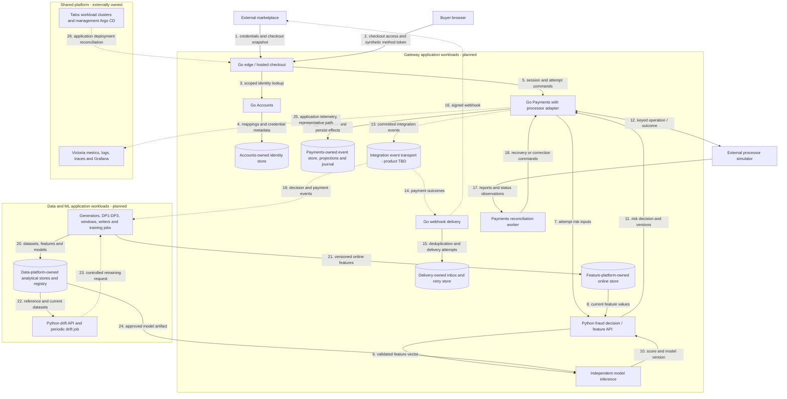
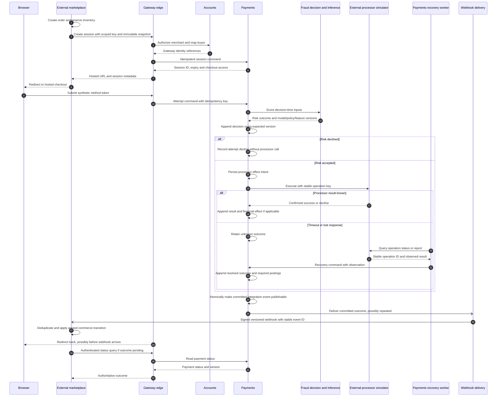
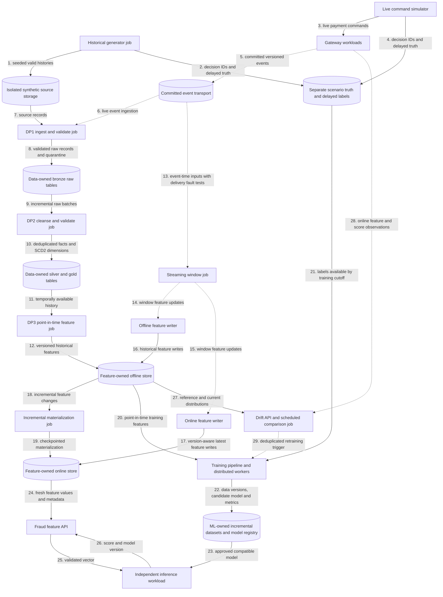

# Payment gateway architecture

This is the **planned target** for an ecommerce payment gateway with fraud decisioning. The repository currently supplies a terminal-oriented fraud inference foundation. The target integrates with the refurbished marketplace, takes synthetic payment-method tokens through hosted checkout, evaluates risk, executes simulated processor operations, and delivers durable payment outcomes. It also produces reproducible data for the mini-coursework and its final ML extension.

Delivery is tracked in [PG-01 (#29)](https://github.com/phuchoang2603/realtime-credit-card-fraud-detection/issues/29) and the [gateway roadmap](https://github.com/users/phuchoang2603/projects/3). See the [coursework guide](../coursework/README.md) for capability coverage and acceptance evidence.

## Current foundation

These are source/configuration observations, not a fresh verification of running dev or production systems.

| Area | Repository evidence | What exists / what remains |
| --- | --- | --- |
| Inference | [main.py](../../src/fraud-service/app/main.py), [bundled model](../../src/fraud-service/models/model.pkl) | FastAPI `/predict` and `/health`; model loaded from `MODEL_PATH` or bundled pickle. Health reports `service_up_no_model` when unavailable; prediction returns 503. This is not yet an independently deployed feature API plus inference engine. |
| Inputs | [schema.py](../../src/fraud-service/app/schema.py), [preprocessing](../../src/fraud-service/app/utils/data_preprocessing.py) | Caller supplies customer and terminal 1/7/30-day features. No ecommerce feature retrieval or gateway payment authority is implemented. |
| Quality | [tests](../../src/fraud-service/tests/test_main.py), [CI](../../.github/workflows/ci.yml) | Ruff and pytest with an 80% coverage gate. This does not establish final ML coverage greater than 90% or mutation score greater than 80%. |
| Packaging and release | [Dockerfile](../../infra/docker/fraud-service.Dockerfile), [release workflow](../../.github/workflows/release.yml) | Container build and GHCR publication on service changes to main, with SHA and latest tags. Per-workload data/ML CI/CD remains planned. |
| Deployment | [chart](../../infra/charts/fraud-service/Chart.yaml), [dev root](../../infra/argocd/dev/root.yaml), [prod root](../../infra/argocd/prod/root.yaml), [GitOps guide](../deployment/gitops.md) | Application resources for shared Talos environments in `payment-gateway`; configured targets do not establish live rollout success. |
| Telemetry | [metrics](../../src/fraud-service/app/utils/metrics_config.py), [logs](../../src/fraud-service/app/utils/logging_config.py), [traces](../../src/fraud-service/app/utils/tracing_config.py), [observability guide](../deployment/shared-observability.md) | Application instrumentation, scrape/rule/dashboard configuration, historical screenshots. End-to-end collection needs current operational proof. |
| Research | [background](../research/ccfd-background.md), [experiments](../research/ccfd-experiements-report.md) | Prior fraud research is context, not acceptance of the planned ecommerce data or model. |

The [Excalidraw diagram](mlops1-arch.excalidraw.svg) and [editable source](mlops1-arch.excalidraw) describe historical work. They are preserved separately from the target diagrams below.

## Ownership and deployment boundaries

The [marketplace gateway note](https://github.com/phuchoang2603/refurbished-marketplace/blob/main/docs/ecommerce-fraud-gateway.md) supplies commerce context. Marketplace owns buyers, sellers, catalog/prices, carts, orders, shipping choices, and inventory reservation/commit/release. Gateway stores scoped references and immutable checkout snapshots; it does not become their system of record.

The [marketplace architecture](https://github.com/phuchoang2603/refurbished-marketplace/blob/main/docs/architecture.md) is the reference for service composition roots, Go modules, transport/domain/persistence separation, service-owned data, inbox/outbox patterns, and shared telemetry conventions. Shared packages may contain infrastructure helpers and versioned contracts, not shared mutable domain models or cross-service database access. Concrete layout and skeletons belong to [PG-02 (#30)](https://github.com/phuchoang2603/realtime-credit-card-fraud-detection/issues/30).

Shared cluster provisioning, networking, storage operators, secret operators, Argo CD, and Victoria backends/collectors belong to [talos-proxmox](https://github.com/phuchoang2603/talos-proxmox/blob/main/apps/README.md). This repository owns its application deployments, service policies, dashboards, scrape resources and rules. Older [local deployment documentation](../deployment/gitops.md) attributes shared ownership to marketplace; the platform repository documents the current split. Resolve that wording in a follow-up without adopting shared resources here.

| Planned deployable unit | Language / role | Owned state |
| --- | --- | --- |
| Edge / hosted checkout | Go; merchant API and browser checkout boundary | Bounded checkout access; authoritative sessions remain with Payments |
| Accounts | Go; integration authorization and identity mapping | Integration credentials/metadata, merchant accounts, customer mappings |
| Payments | Go; sessions, attempts, event-sourced payment commands | Aggregate streams, command results, projections, effect intents, journal, publication state |
| Webhook delivery | Go; signed versioned delivery with retries | Consumer inbox, subscriptions/delivery attempts, retry state |
| Fraud decision / feature API | Python; validate inputs, retrieve online features, apply risk policy | Versioned policy and decision metadata; no payment authority |
| Model inference | Independently deployable Python ML workload | Approved immutable model artifact and feature contract |
| Drift API and periodic drift job | Python; online ingestion and scheduled comparisons | Versioned reference windows, drift results, retraining trigger state |
| Historical generator and live simulator | Data/simulation jobs | Seeded profiles/scenarios; separate delayed-label truth |
| DP1, DP2, DP3 and streaming windows | Data jobs with separate observable stages | Bronze, curated tables, historical features, checkpoints and validation results |
| Offline writer, online writer, materialization | Independently deployable jobs | Store-specific writes, checkpoints, freshness/version handling |
| Training pipeline | Python ML jobs, including distributed workers | Versioned training data, metrics and candidate model artifacts |
| Reconciliation worker | Payments-owned worker | Processor observations/discrepancies; corrections go through Payments commands |

Processor adapters and the financial journal initially live within Payments. An adapter, SDK, aggregate, or class is not a separate microservice. Physical storage products, event-store implementation, broker, pipeline orchestrator, feature platform, and new application frameworks remain undecided. Existing platform products above describe the foundation, not mandatory choices for every target workload.

## Planned deployment view

Solid arrows carry synchronous requests/responses or storage operations. Dotted arrows carry asynchronous events or telemetry. Arrow numbers are local to this diagram. Data/training internals are expanded in the data/ML view.

Shared platform hosting applies to all gateway/data workloads; the last two edges are representative to keep the deployment view readable. They do not give application services ownership of the platform.

## Identity and checkout contract

One authenticated marketplace integration manages separate gateway merchant accounts for its sellers. Accounts maps `(integration_id, external_seller_id)` to `merchant_id` and `(integration_id, external_buyer_id)` to `customer_id`. Derive integration identity from credentials, not caller-selected tenant fields or email. Authorize seller provisioning explicitly and make it idempotent; buyer mapping may be lazy. This refines the marketplace note's earlier suggestion that both records could be created lazily.

Buyer authentication remains at marketplace. Gateway checkout uses short-lived, scoped access without gateway buyer passwords or shared marketplace JWT secrets. Merchant records do not imply wallets, payouts or bank accounts. Credential rotation, revocation, disabled-account handling and tenant isolation belong to [PG-03 (#31)](https://github.com/phuchoang2603/realtime-credit-card-fraud-detection/issues/31) and [Accounts (#34)](https://github.com/phuchoang2603/realtime-credit-card-fraud-detection/issues/34).

Keep order, session, payment and attempt identifiers distinct. Scope external order references to the integration and merchant. Session creation is idempotent for the agreed order scope; changed payload under an existing key is a conflict. Refreshing hosted checkout creates no new attempt. Amount/currency and commerce snapshots are immutable for that session; return URLs are validated. Signed webhook delivery and authenticated status queries determine commerce outcomes, never the buyer redirect alone.

The marketplace's [current webhook handler](https://github.com/phuchoang2603/refurbished-marketplace/blob/main/services/payment/internal/service/gateway_webhook.go) treats failed sessions as terminal and suppresses subsequent terminal outcomes. Target retries under the same order therefore require a contract change. [PG-04 (#32)](https://github.com/phuchoang2603/realtime-credit-card-fraud-detection/issues/32) must separate attempt decline from final payment failure, specify expiry/late-success handling, and coordinate inventory behavior with marketplace. This document does not resolve that mismatch by assuming compatibility.

## Payment authority and recovery

Payments owns an ordered event stream per aggregate. Commands validate authoritative aggregate state and append with an expected version; stale status projections cannot authorize money movement. Durable idempotency stores the request identity, content binding and result so concurrent retries cannot create additional effects. Status views and snapshots are rebuildable; schema versions, correlation IDs and causation IDs preserve interpretation.

Persist an external-effect intent before calling the processor and reuse a stable operation key on retries. A timeout means **unknown**, not declined: query processor status or reconcile its reports before deciding whether another operation is safe. Record discovered results as new events. Reconciliation uses stable operation/transaction IDs rather than timestamp equality and separates timing differences from true discrepancies.

Record each risk outcome with model, policy and feature versions. Aggregate replay consumes the recorded outcome; it never reruns models, invokes processors, or sends webhooks. Recovery workers resume unresolved intents explicitly; projection replay does not activate external effects. Publish integration events atomically with committed domain state through an outbox or equivalent commit-log boundary. Consumers deduplicate stable event identities; transport may be at least once. A broker alone is not the authoritative event store, and transport does not promise exactly-once execution.

Financial postings are distinct from domain workflow events and integration messages. The Payments-owned journal records balanced confirmed effects per currency in integer minor units; authorization holds differ from captured funds. Source event identity prevents duplicate postings. Refunds cannot cumulatively exceed captured funds, and corrections use compensating postings/events rather than edited history. The precise transactional/projection boundary belongs to [journal work (#36)](https://github.com/phuchoang2603/realtime-credit-card-fraud-detection/issues/36).

Event schemas and full transition catalogs belong to [PG-05 (#33)](https://github.com/phuchoang2603/realtime-credit-card-fraud-detection/issues/33); implementation follows in [event storage (#35)](https://github.com/phuchoang2603/realtime-credit-card-fraud-detection/issues/35), [processor recovery (#38)](https://github.com/phuchoang2603/realtime-credit-card-fraud-detection/issues/38), [refunds (#58)](https://github.com/phuchoang2603/realtime-credit-card-fraud-detection/issues/58), and [reconciliation (#59)](https://github.com/phuchoang2603/realtime-credit-card-fraud-detection/issues/59).

## Planned checkout and recovery flow

Numbering restarts here. Solid closed arrows are requests, dotted closed arrows are responses, and open arrows are asynchronous delivery. Alternatives show different outcomes of the same operation.

Worker crashes, callback races and late results must converge on the same recorded effect. Webhook outages cause bounded retries/backoff and observable delivery state. An unresolved payment stays pending for recovery; the browser returning does not prove payment success. The retry/expiry contract above must be agreed before marketplace releases inventory on failure.

## Planned data and ML flow

Numbering restarts here. Solid arrows show batch/storage transfers and synchronous reads; dotted arrows show streaming events or asynchronous triggers. Storage nodes are labelled by role; feature-access libraries are embedded in jobs/APIs rather than depicted as deployable services.

Historical generation persists valid lifecycle histories outside bronze and outside production payment event storage. Live simulation calls gateway commands so Payments creates authoritative events. Both modes share versioned scenarios for customer, seller, device and synthetic method profiles: ordinary purchases, stolen-card/new-device behavior, unusual geography, reshipping, card testing and retry attacks. Burst, lateness and duplicate delivery are transport conditions; they never fabricate duplicate authoritative transitions.

DP1 ingests and validates raw records; DP2 cleanses and curates them; DP3 computes historical features. Each has observable ingest/validate stages, reusable centrally managed connections/configuration, quarantine or failed validation evidence, and source/table/job lineage. Bronze uses `raw_`, silver `stg_`, and gold `dim_`, `fact_`, `obt_`, `feat_` conventions. SCD2 dimensions carry `valid_from_ts`, `valid_to_ts`, `is_current`; feature tables carry `event_timestamp` and `created`.

Training grain is one scored attempt/decision, not one payment event. Joins use scoped identity plus decision/attempt IDs; labels remain separate with `label_available_at`. Features use only information available at decision time, including ingestion/availability timestamps when events arrive late. Future outcomes, fraud truth and the decision itself must not leak into its features. Temporal evaluation splits, cold starts and late-label cases require explicit proof.

Streaming windows specify event time, watermarks, allowed lateness, deduplication and restart semantics. Offline and online writers are independently observable. Incremental materialization has checkpoints, retries and version-aware idempotency; older late writes cannot replace newer online state. Per-feature TTL, stale/missing defaults and feature-version compatibility protect serving.

Training extends the accepted [mini baseline (#67)](https://github.com/phuchoang2603/realtime-credit-card-fraud-detection/issues/67): [notebook acceptance (#53)](https://github.com/phuchoang2603/realtime-credit-card-fraud-detection/issues/53) requires that baseline, although exploration can overlap. Distributed training, incremental dataset storage, model registration and approved-model rollout add capabilities without replacing mini generators, pipelines, windows or evidence. Drift compares versioned distributions without assuming immediate labels; retraining is deduplicated and cooldown-controlled, and promotion remains separately gated. See the [handoff checklist](../coursework/README.md#mini-to-final-handoff).

## Delivery sequence

The first working slice is [hosted checkout #37](https://github.com/phuchoang2603/realtime-credit-card-fraud-detection/issues/37) → [rules-based fraud decision #39](https://github.com/phuchoang2603/realtime-credit-card-fraud-detection/issues/39) → simulated capture → durable financial outcome → [signed webhook delivery #40](https://github.com/phuchoang2603/realtime-credit-card-fraud-detection/issues/40) → [marketplace integration #41](https://github.com/phuchoang2603/realtime-credit-card-fraud-detection/issues/41). Demonstrate duplicates, timeouts and recovery before layering in learned risk models. The fraud contract leaves feature retrieval and model inference independently deployable as ML capabilities arrive.

Then accept the mini data baseline, extend it into feature publication/training/serving, and complete refunds and reconciliation. Security, infrastructure reproducibility, tests, telemetry and CI/CD begin with the first service and expand with each workload; the final evidence phase is not a reason to postpone those controls.

## Deferred decisions and limits

- Full identity, checkout and event contracts remain with PG-03 through PG-05; no wire schemas or event catalog are finalized here.
- Synthetic processing comes first. Real card custody, live processor connectivity, wallets, seller payouts, FX and PCI certification are outside this baseline.
- Availability and fraud quality require measured evidence. There is no five-nines or real-world model-quality claim.
- [The internal-service spec](../../openspec/specs/talos-gitops-deployment/spec.md) says no public ingress, while [the chart](../../infra/charts/fraud-service/templates/ingress.yaml) and [values](../../infra/charts/fraud-service/values.yaml) configure Gateway/HTTPRoute exposure. Reconcile intended exposure in the routing/security work [#63](https://github.com/phuchoang2603/realtime-credit-card-fraud-detection/issues/63); this documentation change alters neither manifests nor existing specs.
- Model traffic experiments [#61](https://github.com/phuchoang2603/realtime-credit-card-fraud-detection/issues/61) record the authoritative model per decision. Shadow inference cannot execute payment effects. Application canary delivery [#28](https://github.com/phuchoang2603/realtime-credit-card-fraud-detection/issues/28) is related but does not itself prove model A/B evaluation.
