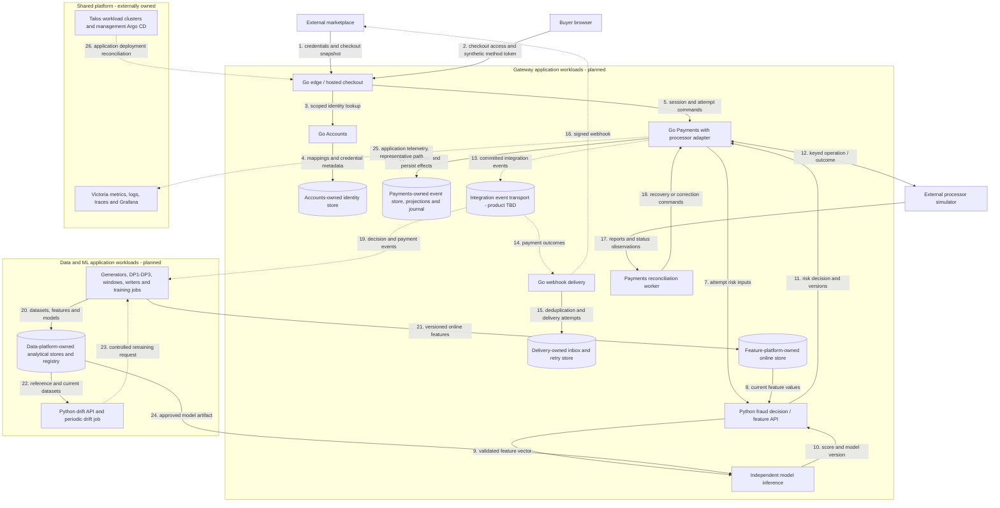

# Payment gateway architecture

This is the **planned target** for an ecommerce payment gateway with fraud decisioning. The repository currently supplies a Go HTTP edge and a Python gRPC fraud service; the target integrates with the refurbished marketplace, takes synthetic payment-method tokens through hosted checkout, evaluates risk, executes simulated processor operations, and delivers durable payment outcomes. It also produces reproducible data for the mini-coursework and its final ML extension.

Companion pages: [payment flows](payment-flows.md) (identity, checkout and payment authority contracts with the checkout sequence), [data and ML flows](data-ml-flows.md) (generators, DP1–DP3, features, training and drift), [service conventions](service-conventions.md) and the [implementation roadmap](roadmap.md). Delivery is tracked on the [project board](https://github.com/users/phuchoang2603/projects/3).

## Current foundation

Source and configuration observations, not a fresh verification of running systems.

| Area       | Repository evidence                                                                                                                                                                                                                        | What exists / what remains                                                                                                                                                                    |
| ---------- | ------------------------------------------------------------------------------------------------------------------------------------------------------------------------------------------------------------------------------------------ | --------------------------------------------------------------------------------------------------------------------------------------------------------------------------------------------- |
| Edge       | [`src/edge`](../../src/edge)                                                                                                                                                                                                               | Public `POST /predict` in protobuf JSON, `/health` and `/ready`; calls fraud over a reused gRPC channel with deadlines and correlation. Hosted checkout, Accounts and Payments are planned.   |
| Fraud      | [`contracts/fraud/v1`](../../contracts/fraud/v1/fraud.proto), [`src/fraud-service`](../../src/fraud-service)                                                                                                                               | `fraud.v1.FraudService/Predict` with strict feature presence, rules, bundled model and gRPC health `liveness`/`readiness`. Online feature retrieval and independent inference are planned.    |
| Quality    | [`ci.yml`](../../.github/workflows/ci.yml), [evidence](../verification/evidence.md)                                                                                                                                                        | Behavior tests for decision rules and real-model repeatability; Go lint; all-chart Helm validation; CI-owned image builds. Numerical coverage/mutation gates were removed as a policy change. |
| Deployment | [chart](../../infra/charts/fraud-service/Chart.yaml), [dev](../../infra/argocd/dev/root.yaml) and [prod](../../infra/argocd/prod/root.yaml) roots, [GitOps guide](../deployment/gitops.md)                                                 | Application resources for shared Talos environments in `payment-gateway`; configured targets do not establish live rollout success.                                                           |
| Telemetry  | [metrics](../../src/fraud-service/app/utils/metrics_config.py), [logs](../../src/fraud-service/app/utils/logging_config.py), [traces](../../src/fraud-service/app/utils/tracing_config.py), [guide](../deployment/shared-observability.md) | Instrumentation, scrape/rule/dashboard configuration and historical screenshots. End-to-end collection needs current operational proof.                                                       |
| Research   | [background](../research/ccfd-background.md), [experiments](../research/ccfd-experiements-report.md)                                                                                                                                       | Prior fraud research is context, not acceptance of the planned ecommerce data or model.                                                                                                       |

The [Excalidraw diagram](mlops1-arch.excalidraw.svg) and [editable source](mlops1-arch.excalidraw) describe historical work and are preserved separately from the target diagram below.

## Ownership and deployment boundaries

The [marketplace gateway note](https://github.com/phuchoang2603/refurbished-marketplace/blob/main/docs/ecommerce-fraud-gateway.md) supplies commerce context. Marketplace owns buyers, sellers, catalog/prices, carts, orders, shipping choices, and inventory reservation/commit/release. Gateway stores scoped references and immutable checkout snapshots; it does not become their system of record.

The [marketplace architecture](https://github.com/phuchoang2603/refurbished-marketplace/blob/main/docs/architecture.md) is the reference for composition roots, Go modules, transport/domain/persistence separation, service-owned data, inbox/outbox patterns and shared telemetry conventions; this repository's adoption is recorded in [service conventions](service-conventions.md). Shared cluster provisioning, networking, storage operators, secret operators, Argo CD and Victoria backends/collectors belong to [talos-proxmox](https://github.com/phuchoang2603/talos-proxmox/blob/main/apps/README.md). This repository owns its application deployments, service policies, dashboards, scrape resources and rules.

| Planned deployable unit                        | Language / role                                                      | Owned state                                                                                 |
| ---------------------------------------------- | -------------------------------------------------------------------- | ------------------------------------------------------------------------------------------- |
| Edge / hosted checkout                         | Go; merchant API and browser checkout boundary                       | Bounded checkout access; authoritative sessions remain with Payments                        |
| Accounts                                       | Go; integration authorization and identity mapping                   | Integration credentials/metadata, merchant accounts, customer mappings                      |
| Payments                                       | Go; sessions, attempts, event-sourced payment commands               | Aggregate streams, command results, projections, effect intents, journal, publication state |
| Webhook delivery                               | Go; signed versioned delivery with retries                           | Consumer inbox, subscriptions/delivery attempts, retry state                                |
| Fraud decision / feature API                   | Python; validate inputs, retrieve online features, apply risk policy | Versioned policy and decision metadata; no payment authority                                |
| Model inference                                | Independently deployable Python ML workload                          | Approved immutable model artifact and feature contract                                      |
| Drift API and periodic drift job               | Python; online ingestion and scheduled comparisons                   | Versioned reference windows, drift results, retraining trigger state                        |
| Historical generator and live simulator        | Data/simulation jobs                                                 | Seeded profiles/scenarios; separate delayed-label truth                                     |
| DP1, DP2, DP3 and streaming windows            | Data jobs with separate observable stages                            | Bronze, curated tables, historical features, checkpoints and validation results             |
| Offline writer, online writer, materialization | Independently deployable jobs                                        | Store-specific writes, checkpoints, freshness/version handling                              |
| Training pipeline                              | Python ML jobs, including distributed workers                        | Versioned training data, metrics and candidate model artifacts                              |
| Reconciliation worker                          | Payments-owned worker                                                | Processor observations/discrepancies; corrections go through Payments commands              |

Processor adapters and the financial journal initially live within Payments. An adapter, SDK, aggregate or class is not a separate microservice. Physical storage products, event-store implementation, broker, pipeline orchestrator, feature platform and new application frameworks remain undecided.

## Planned deployment view

Solid arrows carry synchronous requests/responses or storage operations. Dotted arrows carry asynchronous events or telemetry. Arrow numbers are local to this diagram; data/training internals are expanded in [data and ML flows](data-ml-flows.md).

Shared platform hosting applies to all gateway/data workloads; the last two edges are representative to keep the view readable and do not give application services ownership of the platform.

## Delivery sequence

The first working slice is [hosted checkout #37](https://github.com/phuchoang2603/realtime-credit-card-fraud-detection/issues/37) → [rules-based fraud decision #39](https://github.com/phuchoang2603/realtime-credit-card-fraud-detection/issues/39) → simulated capture → durable financial outcome → [signed webhook delivery #40](https://github.com/phuchoang2603/realtime-credit-card-fraud-detection/issues/40) → [marketplace integration #41](https://github.com/phuchoang2603/realtime-credit-card-fraud-detection/issues/41). Demonstrate duplicates, timeouts and recovery before layering in learned risk models. The fraud contract leaves feature retrieval and model inference independently deployable as ML capabilities arrive.

Then accept the mini data baseline, extend it into feature publication/training/serving, and complete refunds and reconciliation. Security, infrastructure reproducibility, tests, telemetry and CI/CD begin with the first service and expand with each workload.

## Deferred decisions and limits

- Full identity, checkout and event contracts remain with PG-03 through PG-05; no wire schemas or event catalog are finalized here.
- Synthetic processing comes first. Real card custody, live processor connectivity, wallets, seller payouts, FX and PCI certification are outside this baseline.
- Availability and fraud quality require measured evidence. There is no five-nines or real-world model-quality claim.
- Fraud is internal-only gRPC on port 8000 with named health probes; the chart creates no public ingress. The Go edge owns HTTP/JSON translation. Gateway exposure and routing policy remain with [#63](https://github.com/phuchoang2603/realtime-credit-card-fraud-detection/issues/63).
- Model traffic experiments [#61](https://github.com/phuchoang2603/realtime-credit-card-fraud-detection/issues/61) record the authoritative model per decision. Shadow inference cannot execute payment effects. Application canary delivery [#28](https://github.com/phuchoang2603/realtime-credit-card-fraud-detection/issues/28) is related but does not itself prove model A/B evaluation.
