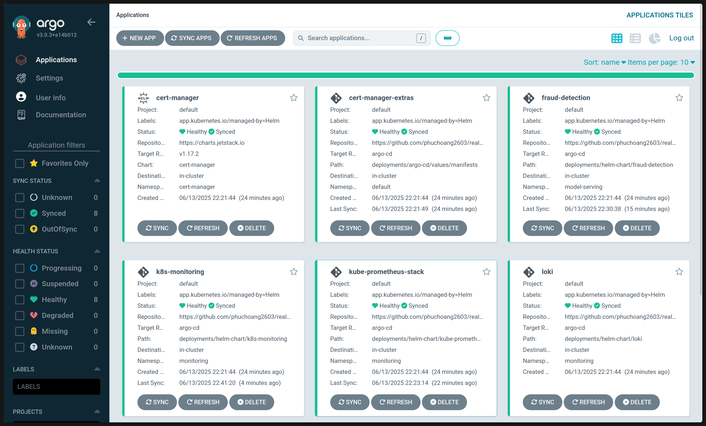

# GitOps deployment

The fraud service targets shared Talos `dev` and `prod` clusters through Argo CD. The marketplace repository owns cluster infrastructure and Victoria operators/backends. This repository owns payment-gateway application resources.

Argo roots are [`infra/argocd/dev/root.yaml`](../../infra/argocd/dev/root.yaml) and [`infra/argocd/prod/root.yaml`](../../infra/argocd/prod/root.yaml). Both roots and their child Application CRs reside in the management cluster's `argo-cd` namespace. Children target registered cluster names `dev`/`prod` and namespace `payment-gateway`.

| Environment | Root | Child Application | Helm release | Values |
|---|---|---|---|---|
| Dev | `payment-gateway-dev-root` | `payment-gateway-dev-fraud-service` | `fraud-service` | Chart defaults |
| Prod | `payment-gateway-prod-root` | `payment-gateway-prod-fraud-service` | `fraud-service` | Defaults plus `values-prod.yaml` |

The child template renders each `valuesFile` entry separately using its `$values/` repository reference. It explicitly sets the Helm release name, so the internal Service is `fraud-service` in both separate workload clusters. Pod and scrape selectors use the application-owned `payment-gateway/release` label instead of Argo's `app.kubernetes.io/instance` tracking label; Argo may change the latter without breaking selectors.

## Revisions and dev branches

Each root defines `targetRevision: &revision main` and reuses `*revision` in `spec.source.helm.valuesObject.global.targetRevision`. For a dev branch rollout, change the anchored value in `infra/argocd/dev/root.yaml` to the branch or commit SHA. YAML resolves the same revision for the root catalog and child chart/value sources. Commit the chart changes on that branch, then submit the updated root to management Argo CD using the normal GitOps process. Changing only the live root's `targetRevision` through the Argo UI does not update the embedded child revision: update both fields together or use the anchored source file. Restore the anchor to `main` when the branch rollout ends.

Production continues to track `main`. The release workflow preserves version-tagged GHCR images; revisions do not inject image tags.

## Internal access and rollout prerequisites

After choosing the intended workload cluster context, inspect the service with:

```bash
kubectl --context <workload-context> -n payment-gateway port-forward svc/fraud-service 8000:8000 8010:8010
```

The service is a `ClusterIP` exposing HTTP 8000 and metrics 8010, with the existing `/app/models/model.pkl` configuration and `/health` probes. Dev also renders a Cilium Gateway and HTTPRoute at `fraud-dev.phuchoang.sbs`; TLS terminates upstream, so the in-cluster listener is HTTP.

Complete the owner-specific [shared observability checklist](shared-observability.md) independently for dev and prod before accepting rollout. Missing discovery, CRDs, datasource configuration, or network access blocks acceptance; this repo does not add fallback shared infrastructure. See [CI and release](ci.md) for validation and publication responsibilities.


