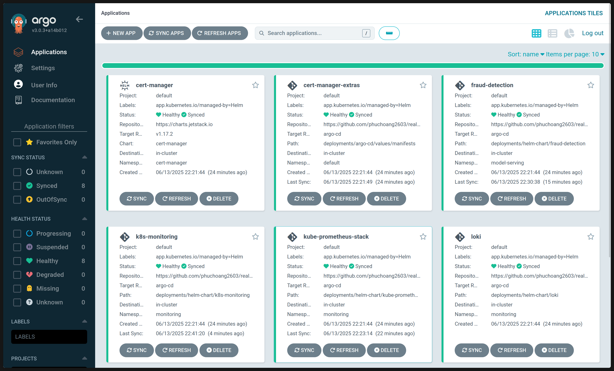

# GitOps deployment

The first GitOps rollout is a prod-only Kubeflow workspace. [talos-proxmox](https://github.com/phuchoang2603/talos-proxmox/blob/main/docs/operations/kubeflow.md) owns the shared Talos clusters, Argo CD, Kubeflow controllers, Dex SSO, External Secrets, Argo Workflows, and ingress. This repository owns its own Profile and workload resources. The fraud-service chart is available for a later rollout but is not enabled in either environment.

Argo roots are [`infra/argocd/dev/root.yaml`](../../infra/argocd/dev/root.yaml) and [`infra/argocd/prod/root.yaml`](../../infra/argocd/prod/root.yaml). Each environment has its own Argo CD in `argo-cd` and manages only its local cluster. The dev root currently renders no children. The prod children target prod's local Kubernetes server and create resources in the Profile-owned `fraud-ml-prod` namespace; they use `argo-cd` as their Argo destination so Argo does not create the Profile namespace first.

| Environment | Root                        | Enabled child Application                   | Helm release         | Configuration                                       |
| ----------- | --------------------------- | ------------------------------------------- | -------------------- | --------------------------------------------------- |
| Prod        | `payment-gateway-prod-root` | `payment-gateway-prod-secret-store`         | `secret-store`       | `values-prod.yaml`: Doppler `prd` in `fraud-ml-prod` |
| Prod        | `payment-gateway-prod-root` | `payment-gateway-prod-kubeflow-workspace`   | `kubeflow-workspace` | Profile and namespace resources in `fraud-ml-prod`  |

The child template renders each `valuesFile` entry separately using its `$values/` repository reference and explicitly sets the Helm release name. When fraud-service is later enabled, its internal Service is `fraud-service` in the target cluster's `payment-gateway` namespace. Its Pod and Service selectors use the application-owned `payment-gateway/release` label instead of Argo's `app.kubernetes.io/instance` tracking label.

The workspace chart owns the `fraud-ml-prod` Kubeflow Profile (with the same email identity as platform Dex), the namespace-scoped Hub Registry and its database ExternalSecret, RustFS artifact credentials via ExternalSecret, a KFP launcher, and an Argo artifact repository. The generic `secret-store` chart is disabled by default and enabled only through its prod values file. Its token has read-only access to the `realtime-credit-card-fraud-detection` Doppler project's `prd` config, which holds `KUBEFLOW_REGISTRY_DB_PASSWORD`, `KUBEFLOW_RUSTFS_ACCESS_KEY`, and `KUBEFLOW_RUSTFS_SECRET_KEY`. No secret values are committed to Git. Reconcile the platform first: its Profile controller creates the namespace with ambient mesh enabled. The prod store and workspace Applications retry while the platform CRDs and Profile namespace become available. Kubernetes-native Pipelines are experimental, and the Hub Registry database uses local storage without HA; do not use this workspace with valuable production data until end-to-end validation, backup, and restore are in place.

Once the Profile namespace exists, provision Kubernetes Secret `fraud-doppler-token` with key `dopplerToken` in `fraud-ml-prod`, using `ESO_DOPPLER_TOKEN` from the consumer Doppler `prd` config. Do not commit or print the token. The prod SecretStore and workspace ExternalSecrets can then reconcile; re-provision after namespace recreation or token rotation. The RustFS access key currently matches the shared platform's bucket-scoped identity, so separate Doppler ownership does not yet imply separate S3 access; provision a distinct RustFS identity before requiring storage isolation. Verify Profile ownership, ExternalSecret readiness, authenticated Dashboard access, and a real pipeline artifact upload and download before calling the workspace operational.

## Revisions and branch rollouts

Each root defines `targetRevision: &revision main` and reuses `*revision` in `spec.source.helm.valuesObject.global.targetRevision`. For a branch rollout, change the anchored value in the root for that environment to the branch or commit SHA. YAML resolves the same revision for the root catalog and child chart/value sources. Commit the chart changes on that branch, then submit the updated root to that environment's Argo CD using the normal GitOps process. Changing only the live root's `targetRevision` through the Argo UI does not update the embedded child revision: update both fields together or use the anchored source file. Restore the anchor to `main` when the branch rollout ends.

When fraud-service is later enabled, dev follows the moving GHCR `latest` image and always pulls it. Production tracks `main` and should pin an immutable commit-SHA tag in `values-prod.yaml` once a promotion policy exists; the release workflow publishes both `latest` and short-SHA tags on every `main` push.

## Runtime configuration

Both services validate configuration at startup and exit non-zero with a sanitized diagnostic on invalid values. Boolean switches accept only `true` or `false` (case-insensitive).

| Service | Variable                           | Default                                                  | Purpose                                                          |
| ------- | ---------------------------------- | -------------------------------------------------------- | ---------------------------------------------------------------- |
| fraud   | `GRPC_PORT`                        | `8000`                                                   | Internal gRPC listener                                           |
| fraud   | `METRICS_PORT` / `METRICS_ENABLED` | `8010` / `true`                                          | Prometheus listener                                              |
| fraud   | `GRACEFUL_SHUTDOWN_TIMEOUT`        | `30`                                                     | RPC drain seconds; shutdown watchdog bounds process exit              |
| fraud   | `TRACING_ENABLED`                  | `false`                                                  | Opt-in instance-owned OpenTelemetry provider                     |
| fraud   | `OTEL_SERVICE_NAME`                | `fraud-service`                                          | Identity for logs, metrics and traces                            |
| fraud   | `OTEL_EXPORTER_OTLP_ENDPOINT`      | unset                                                    | Required only when tracing is enabled; explicit OTLP/gRPC target |
| edge    | `EDGE_HTTP_ADDR`                   | `:8080`                                                  | Public HTTP listener                                             |
| edge    | `EDGE_SHUTDOWN_TIMEOUT`            | `10s`                                                    | HTTP drain budget                                                |

The chart sets `terminationGracePeriodSeconds: 40` to cover the 30 s drain, bounded telemetry cleanup and the forced-exit margin.

## Internal access and rollout prerequisites

When fraud-service is later enabled, choose the intended workload cluster context and inspect the service with:

```bash
kubectl --context <workload-context> -n payment-gateway port-forward svc/fraud-service 8000:8000 8010:8010
```

The fraud-service chart creates a `ClusterIP` exposing gRPC 8000 and HTTP metrics 8010. Kubernetes 1.27+ probes the standard gRPC health service using the `liveness` and `readiness` names. The chart creates no Gateway, HTTPRoute or public ingress. This Deployment/ClusterIP layout is staged but not deployed; the planned target replaces it with a cluster-local Knative Service and a KServe predictor ([#70](https://github.com/phuchoang2603/realtime-credit-card-fraud-detection/issues/70)). Public HTTP traffic belongs at the Go edge; edge deployment remains part of gateway delivery. Pair the gRPC image and chart in a rollout or rollback; the old HTTP image cannot satisfy gRPC probes. Use an immutable published image SHA for a real rollout, replacing the development `latest` default.

The [shared observability guide](shared-observability.md) describes the interim limits: platform-collected stdout logs, an exposed but uncollected fraud metrics endpoint, and disabled trace export. No application dashboard or alert is installed; telemetry integration is not a rollout prerequisite. Image publication is described in [CONTRIBUTING](../../CONTRIBUTING.md#ci-and-images).


