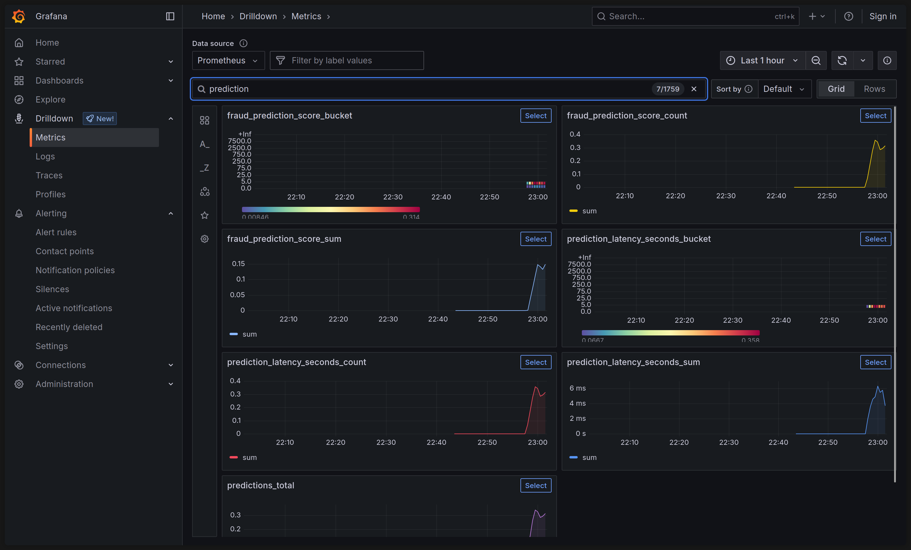
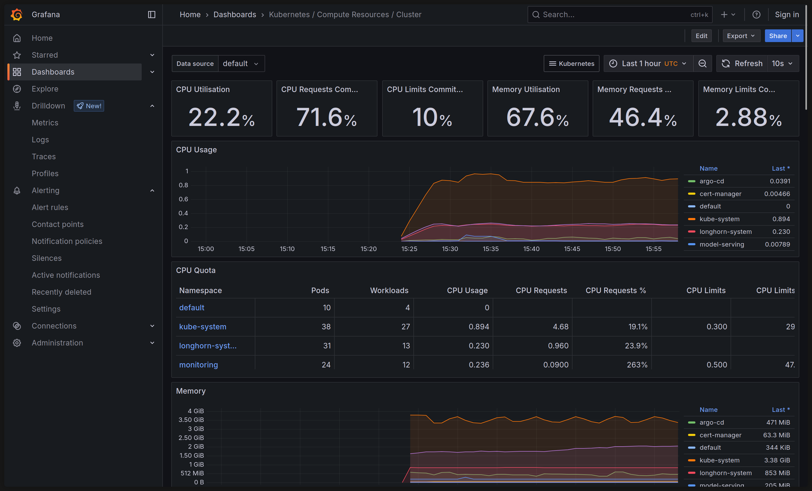
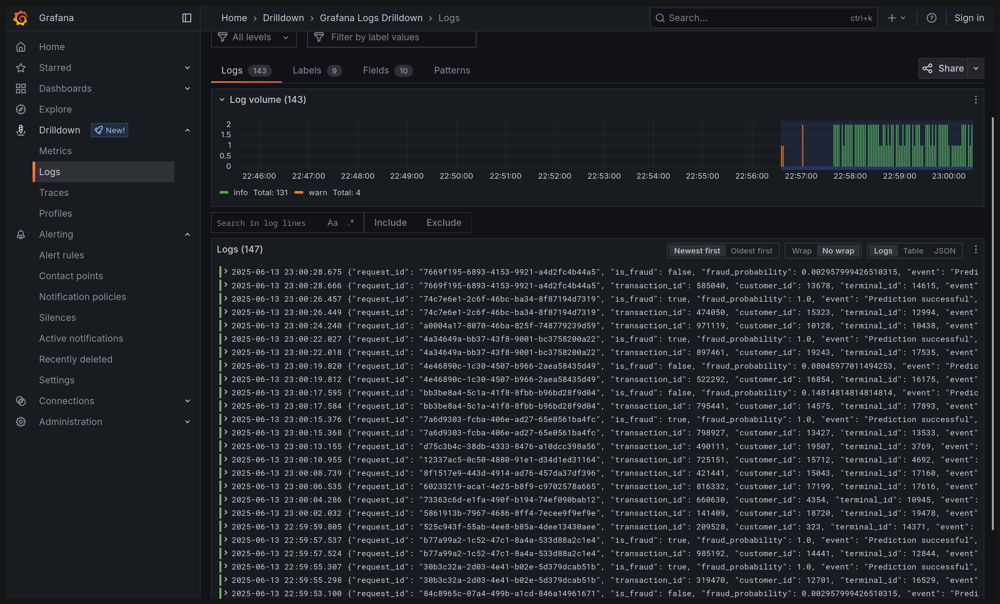
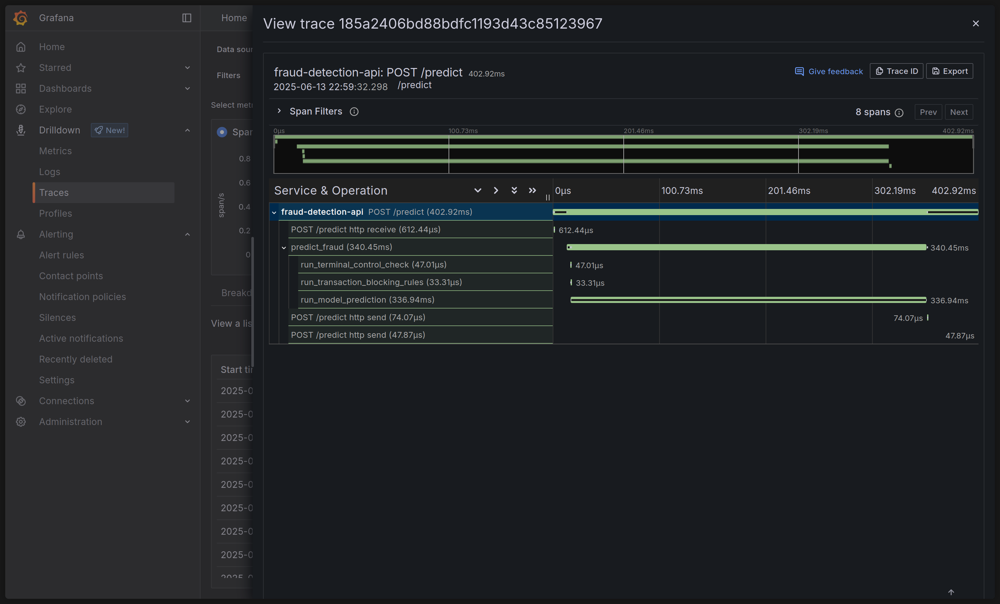

# Shared Victoria Observability

`fraud-service` integrates with the shared VictoriaMetrics stack (`VictoriaMetrics`, `VictoriaLogs`, `VictoriaTraces`, and Grafana) deployed in the cluster.

## Configuration

Telemetry and discovery settings are managed via `infra/charts/fraud-service/values.yaml` (or environment-specific overlays like `values-prod.yaml`):

- `telemetry.serviceName`: OTLP service name (default: `fraud-service`).
- `telemetry.traceEndpoint`: OTLP/gRPC endpoint for VictoriaTraces (default: `vtsingle-vmks.monitoring.svc.cluster.local:4317`).
- `podScrape.labels`: Labels for VMAgent discovery (default: `release: victoria`).
- `dashboards.labels`: Labels for Grafana dashboard sidecar discovery (default: `grafana_dashboard: "1"`).
- `dashboards.datasources`: Datasource UIDs for metrics (`VictoriaMetrics`), logs (`VictoriaLogs`), and traces (`VictoriaTraces`).

## Resources

- **Metrics**: Pods expose Prometheus metrics at `:8010/metrics`, scraped via `VMPodScrape`. Key metrics include `predictions_total`, `prediction_latency_seconds_bucket`, and `fraud_prediction_score_bucket`.
- **Logs**: Structured JSON logs include `service`, `trace_id`, and `span_id`.
- **Traces**: OpenTelemetry traces export directly to VictoriaTraces via gRPC.
- **Alerts**: Prometheus alert rules defined in `VMRule` monitor service availability (`FraudServiceMetricsUnavailable`).
- **Dashboard**: Grafana dashboard ConfigMap is located in `infra/charts/fraud-service/dashboards/`.

## Reference Screenshots

