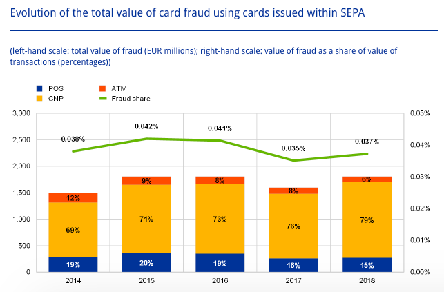
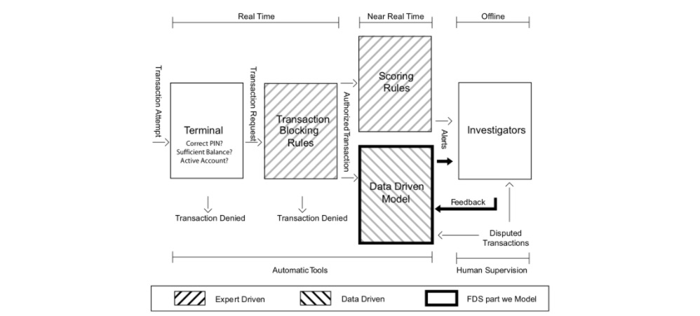
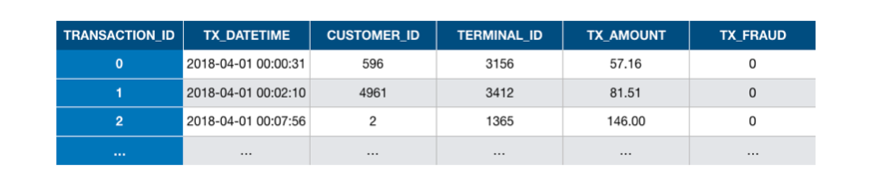
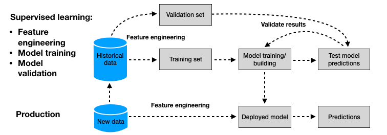

# 📊 Credit Card Fraud Detection Background

## 🔍 Fraud Scenarios

### Types of Fraud

- **Card Present (CP):**

  - _Lost/Stolen Cards_: Legitimate card stolen or lost.
  - _Counterfeited Cards_: Card info skimmed and cloned — mitigated by EMV chip tech.
  - _Card Not Received_: Card intercepted before reaching the customer.
  - ✅ CP fraud trends are decreasing due to security measures.

- **Card Not Present (CNP):**

  - Conducted remotely: phone, email, internet.
  - Arises from leaked credentials (phishing, breaches).
  - Credentials often sold on underground marketplaces.
  - ❗ CNP fraud is harder to trace and more prevalent.

> **Fig. 1**: Card-not-present frauds dominate total fraud value across SEPA-issued cards.

---

## 🛡️ Detection System Architecture

> **Fig. 2**: Multiple layers of defense in a Fraud Detection System (FDS). This notebook focuses on the **data-driven model**.

### Control Layers

1. **Terminal Control**

   - PIN verification, balance, card status, spending limits
   - Real-time queries to issuer server

2. **Transaction-Blocking Rules**

   - Handcrafted `if-else` rules (e.g., deny unsecured internet payments)
   - Fast, expert-defined, applied before feature aggregation

3. **Scoring Rules**

   - `if-else` logic on feature vectors
   - Assigns fraud scores based on patterns (e.g., continent mismatch)

4. **Data-Driven Model (DDM)**

   - ML classifier trained on labeled transaction data
   - Analyzes full feature vectors
   - Identifies fraud patterns beyond expert intuition

5. **Human Investigator**

   - Reviews alerts from scoring and ML
   - Provides labels (fraud/genuine) for feedback loops
   - High-risk alerts may bypass investigators (e.g., SMS confirmation)

---

## 🧠 Machine Learning for Credit Card Fraud Detection

### Transaction Features

- **Account-Related**: account ID, open date, limit, expiry
- **Transaction-Related**: timestamp, amount, merchant category, terminal info
- **Customer-Related**: customer ID, profile type

📌 Transactions labeled as:

- `TX_FRAUD = 0`: Genuine
- `TX_FRAUD = 1`: Fraudulent

---

### ML Workflow

> **Fig. 3**: Common two-stage ML workflow: training on labeled data → predicting new transactions.

#### Model Function

A prediction model $h(x, \theta)$ maps feature inputs $x$ to output label or risk score:

$$
L_{0/1}(y, \hat{y}) =
\begin{cases}
1 & \text{if } y \ne \hat{y} \\
0 & \text{if } y = \hat{y}
\end{cases}
$$

- Training: optimize parameters $\theta$ to minimize prediction loss
- Output: risk score or binary prediction
- Feature Engineering: transforms raw input into usable format

---

### Common Algorithms

- **Logistic Regression (LR), Decision Trees (DT)** – simple, interpretable
- **Random Forests (RF), Boosting** – top-performing
- **Neural Networks (NN/DL)** – cutting-edge, used in research

---

## ⚠️ Challenges in CCFD

### Class Imbalance

- Fraud <1% of transactions
- Need special techniques:

  - Sampling (over/under)
  - Weighted loss

### Concept Drift

- Changes in user/fraud behavior over time
- Requires online/adaptive learning

### Real-Time Constraints

- Decisions must be made in milliseconds
- Scalability is critical

### Categorical Features

- IDs, card types require transformation:

  - Aggregation
  - Embeddings
  - Graph features

### Sequential Nature

- Transaction histories per user or terminal
- Model via time aggregation or sequence models (HMMs, RNNs)

### Class Overlap

- Fraud and genuine often look similar
- Need strong contextual features

### Metrics

- Accuracy and AUC not enough
- Balance **detection rate** vs **false positives**

### Data Availability

- Most datasets are private
- Kaggle (2016) is only public benchmark
- Lack of simulators hinders reproducibility

---

## 📚 Summary

This notebook explores how machine learning is used to detect credit card fraud, focusing on:

- The architecture of fraud detection systems
- Feature engineering and supervised learning workflows
- Practical challenges and best practices in fraud detection

---

## 📎 Reference

Fraud Detection Handbook:
[https://fraud-detection-handbook.github.io/fraud-detection-handbook/Chapter_2_Background/CreditCardFraud.html](https://fraud-detection-handbook.github.io/fraud-detection-handbook/Chapter_2_Background/CreditCardFraud.html)
