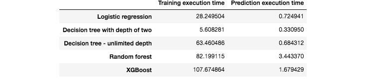
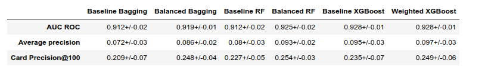

# Reproducible Machine Learning for Credit Card Fraud Detection: A Summary

<!--toc:start-->
- [Reproducible Machine Learning for Credit Card Fraud Detection: A Summary](#reproducible-machine-learning-for-credit-card-fraud-detection-a-summary)
  - [Chapter 3: Baseline ML](#chapter-3-baseline-ml)
  - [Chapter 4: Performance Metrics](#chapter-4-performance-metrics)
  - [Chapter 5: Model Validation and Model Selection](#chapter-5-model-validation-and-model-selection)
  - [Chapter 6: Imbalanced Learning](#chapter-6-imbalanced-learning)
  - [Chapter 7: Deep Learning](#chapter-7-deep-learning)
  <!--toc:end-->
  
This report summarizes the key findings from the "Reproducible Machine
Learning for Credit Card Fraud Detection" handbook, covering baseline models,
performance metrics, model selection, imbalanced learning, and deep
learning techniques.

## Chapter 3: Baseline ML

This chapter establishes a baseline for fraud detection using standard
machine learning models on a real-world dataset.

- **Objective**: To design a baseline fraud detection system with simple
  preprocessing and standard classifiers that performs significantly better
  than random.
- **Methodology**: The study uses a real-world e-commerce transaction
  dataset from Belgium (2018) provided by Worldline. While the data is
  confidential, the results offer insights into real-world performance.
- **Dataset Characteristics**:
  - The dataset comprises approximately 400,000 daily transactions.
  - The fraud rate is about 0.25%, with around 1,000 fraudulent
    transactions per day.
  - Over 300 cards were compromised daily, each averaging 3 fraudulent
    transactions.
- **Baseline Models**: The five models tested were Logistic Regression,
  Decision Tree (depth 2), Decision Tree (unlimited depth), Random Forest,
  and XGBoost.
- **Initial Findings**:
  - Without parameter tuning, XGBoost and logistic regression
    significantly outperformed a random classifier.
  - On the test set, the best model depended on the metric: XGBoost was
    superior for AUC ROC and Average Precision, while logistic regression
    excelled at CP@100.
  - A simple logistic regression model achieved a CP@100 of 0.15, meaning
    it correctly identified 15 of the 100 most suspicious cards daily.
  - Unlimited depth decision trees and random forests showed significant
    overfitting, with perfect training scores that did not generalize.

> _Fig. 1: Test Set Performance of Standard ML Algorithms_

> _Fig. 2: Training Set Performance of Standard ML Algorithms_

> _Fig. 3: Execution Times for Training and Prediction_

## Chapter 4: Performance Metrics

This chapter details the crucial metrics for evaluating fraud detection
models, considering the trade-off between detecting fraud and minimizing
false alarms.

- **Conflicting Goals**: A fraud detection system must maximize the
  detection of fraudulent transactions (recall) while minimizing the
  incorrect flagging of genuine ones (false positives).
- **Key Metrics**: The study recommends a combination of three complementary
  metrics for a comprehensive assessment.
  - **AUC ROC (Area Under the Receiver Operating Characteristic Curve)**:
    A widely used metric reflecting accuracy across all decision
    thresholds. It is, however, often poorly suited for class-imbalanced
    problems.
  - **AP (Average Precision)**: Reflects accuracy across thresholds but
    emphasizes regions where precision is high. Real-world AP scores are
    lower than in simulations due to a lower fraud proportion.
  - **CP@k (Card Precision top-k)**: A concrete metric that assesses the
    average daily precision for a fixed number (`k`) of the most
    suspicious cards an investigator can review. The experiments used `k=100`.
- **Real-World Performance**:
  - XGBoost achieved the best performance in terms of AUC ROC with a score
    of 0.899.
  - The Random Forest model's performance in terms of AP was poor, an
    issue attributed to overfitting.

## Chapter 5: Model Validation and Model Selection

This chapter focuses on the methods for selecting the best model and tuning
its hyperparameters to ensure optimal performance on future data.

- **Objective**: Model selection is aimed at finding the model with the
  highest expected performance on the next block of transactions.
- **Prequential Validation**: The chapter highlights the prequential
  validation strategy as an effective method for estimating future
  performance.
- **Computational Intensity**: Validation procedures are computationally
  intensive, requiring many repeated training runs with different
  hyperparameters.
- **Model Performance Comparison**:
  - **Decision Trees**: An optimal tree depth between 6 and 9 was
    identified, higher than for simulated data due to more complex
    relationships.
  - **Random Forest**: The best results were obtained using 100 trees with
    a maximum depth of 10.
  - **XGBoost**: This model provided the best performance across all three
    metrics. Optimal parameters were typically 100 trees, a max depth of
    6, and a learning rate of 0.1.
- **Execution Time**: Logistic regression models were the fastest to train
  but yielded the worst performance. Decision tree selection was one to two
  orders of magnitude faster than for Random Forest and XGBoost.

> _Fig. 4: Training vs. Test Performance in Model Selection_

> _Fig. 5: Summary of Model Selection Performances_

> _Fig. 6: Model Selection Execution Times_

## Chapter 6: Imbalanced Learning

This chapter investigates techniques designed to handle the class imbalance
inherent in fraud detection datasets.

- **Objective**: To evaluate cost-sensitive, resampling, and ensemble
  techniques for imbalanced learning in fraud detection.
- **General Takeaway**: The benefits of these techniques are mitigated;
  while they often improve AUC ROC, they are typically detrimental to
  Average Precision and CP@100.
- **Technique Analysis**:
  - **Cost-Sensitive Learning**: Giving more weight to the fraud class
    improves AUC ROC but is detrimental to Average Precision.
  - **Resampling (SMOTE & RUS)**:
    - SMOTE tends to increase AUC ROC but harms performance for Average
      Precision and CP@100.
    - RUS similarly improves AUC ROC but causes a noticeable drop in AP
      and CP@100.
    - A key advantage of undersampling is its ability to reduce
      computation times by up to 20%.
  - **Ensemble Methods**:
    - The best overall prediction performances were achieved with
      ensemble methods.
    - For Balanced Bagging & Random Forest, rebalancing could slightly
      improve AUC ROC. However, for optimizing AP and CP@100, avoiding
      rebalancing was best.
    - For Weighted XGBoost, slightly increasing the minority class weight
      led to small improvements in AP and CP@100.
- **Overall Conclusion**: XGBoost was the top-performing model, showing
  robustness to data imbalance. This is likely because its learning process
  naturally acts like a cost-sensitive technique.

> _Fig. 7: SMOTE and RUS Performance on Real-World Data_

> _Fig. 8: Ensemble Method Performance Summary on Real-World Data_

## Chapter 7: Deep Learning

This final chapter explores the application of various deep learning
architectures to the fraud detection problem.

- **Competitive Performance**: Deep learning methods are competitive with
  classical approaches and deserve a place in a practitioner's toolbox.
- **Advantages of Neural Networks**:
  - They can automate the process of feature engineering and
    representation learning.
  - They are easily federated, differentiable, and support incremental
    learning.
  - Sequential models like CNNs and LSTMs can automatically extract
    features from contextual data, removing the need for manual feature
    creation.
- **Architectures Explored**:
  - **Feed-Forward Network**: Achieves performance comparable to the Random
    Forest baseline.
  - **Autoencoder**: Used for unsupervised anomaly detection by flagging
    outliers based on reconstruction error.
  - **CNN and LSTM (Sequential Models)**: These models use the sequence of
    past transactions to inform predictions. They outperformed the
    feed-forward network.
- **Performance Comparison on Real-World Data**:
  - All tested neural network models performed better than the Logistic
    Regression and Decision Tree baselines on all metrics.
  - Compared to XGBoost and Random Forest, the sequential models (CNN,
    LSTM) achieved a better Average Precision.
  - The LSTM model performed slightly better than the CNN and obtained the
    best Average Precision score overall.
  - Adding an Attention mechanism to the LSTM provided a small additional
    performance gain.
- **Hyperparameter Tuning is Crucial**:
  - Neural network performance is highly dependent on hyperparameter
    settings.
  - Experiments favored a small learning rate and a higher number of
    epochs.
  - A small amount of dropout was beneficial, particularly on the test set.
  - The extensive tuning required comes at a great cost but is valuable for
    the flexibility and performance gains it offers.

> _Fig. 9: Global Comparison of Deep Learning and Baseline Models_